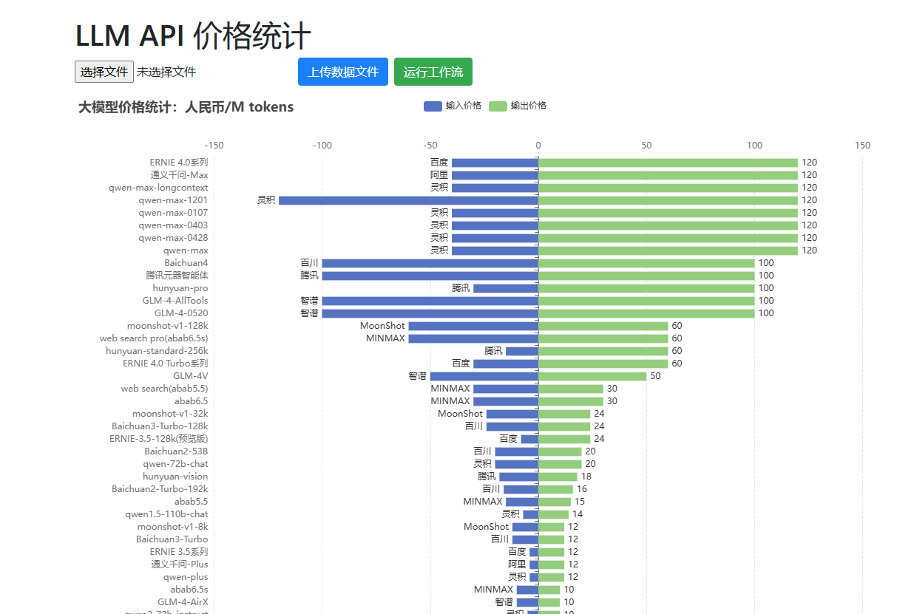

# LLM-API-price-collection
大模型API单价统计

## 快速启动
执行以下命令,使用docker部署.注意需要先安装docker
```bash
git clone https://github.com/xia-huang-411303/LLM-API-price-collection.git
cd LLM-API-price-collection/docker
docker compose up -d
```
启动成功后,打开 http://127.0.0.1:8011/ 即可  



## 使用说明

### 数据收集
使用八爪鱼采集器导入并执行`./task/`下的`大模型服务资费-前端采集.otd`和`大模型服务资费-后端采集.otd`两个任务, 采集结果分别导出保存为 `html.json` 和 `json.json` 两个文件, 导出格式都选择JSON.
然后在页面中上传这两个原始数据文件

### 数据清洗
上传原始数据文件后, 点击运行工作流, 会执行Dify上的数据清洗工作流,  
自动对采集的前端数据和后端数据进行格式统一, 并保存为`./data/results.json`.  
 > 如果运行工作流失败,可以去[大模型资费采集-数据清洗](http://863deprd.tpddns.cn/workflow/JnnTn3LPwyG8HFNO)直接运行工作流,  
 > 将返回的 JSON OUTPUT 手动保存为 `results.json` 并上传为数据文件

### 刷新页面
就能看到更新后的图表了
